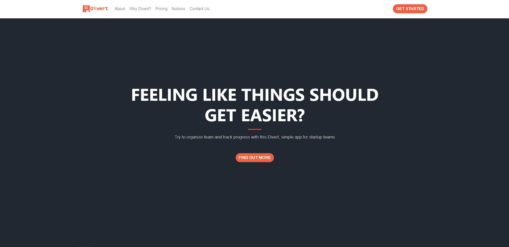
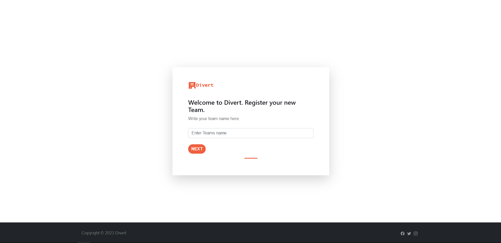
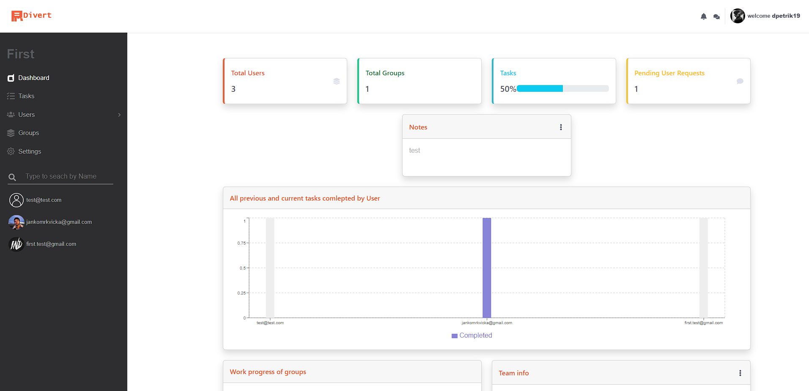
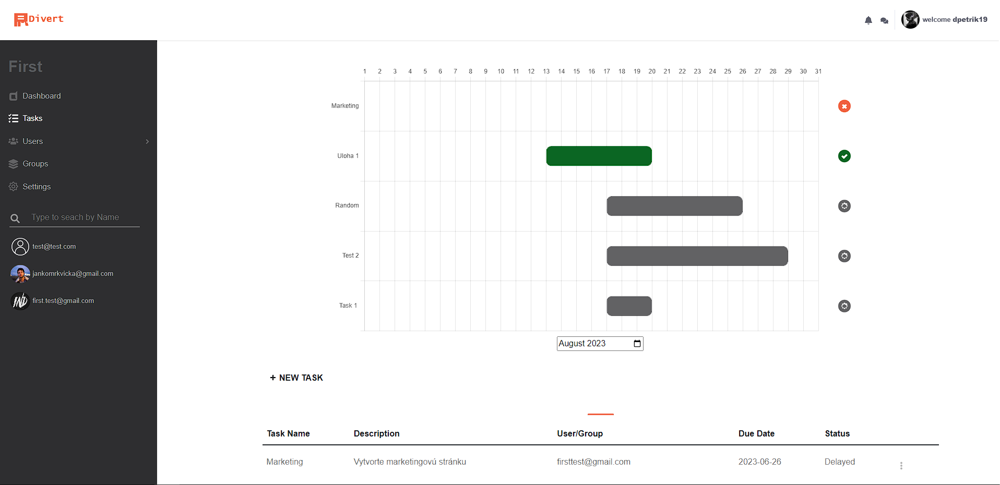
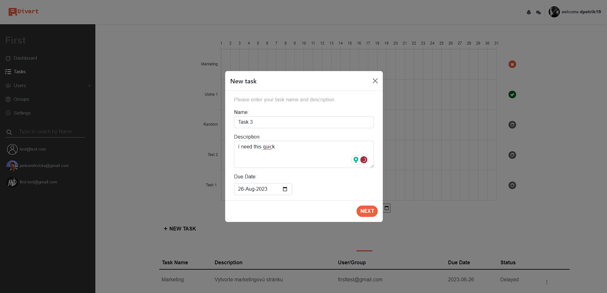
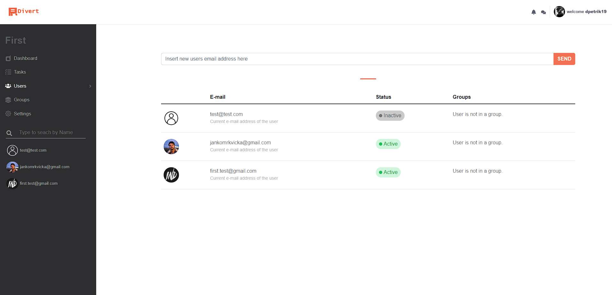

# Divert

The application is built on a traditional web application, meaning it consists of several pages. The main or home page is a Single Page where all the information about this application and how it actually works. The web application is programmed using modern internet technologies such as ```JavaScript```, the front-end framework ```ReactJS```, and the back-end framework ```NodeJS```. React is used for the appearance and functionality of the entire application. Node handles the API and data processing, which are used for communication between users. 

# Appearance and functionality of the application

The created application is a user-friendly software solution designed to provide better and simpler services to users. It offers many features for new users and for starting teams that are in the initial stages of the team-building process.

### 1. User Interface of the Divert Application

    - We will start with the home page of the application. The first main page upon opening the web application is the home page. On this page, you can read more about the application, its features, and functions.



### 2. Team registration, team name

    - When creating a new team, you will be redirected to the first page where you write your inspiring team name.

    - After selecting the team name, you will be redirected to the second page where you choose your team's current plan. There is a free version where you can invite a maximum of three members, the second is a professional version which is paid and allows you to invite a maximum of ten members, and finally, there is a business plan where you can invite up to 100 members.

    - After selecting the plan, you will be redirected to the last page of the guide, where you can invite team members. In the input field, you will enter the team member's email, and upon clicking the "Send" button, the invitation will be sent to the user's email. The input field only accepts properly formatted emails. If the user is already registered, a pop-up window will appear indicating that the user has been added. If the user does not have an account yet, the invitation will be sent to their email and a contextual window will appear with a notification about sending the invitation. This means that when the user opens the link in the email, they will first be redirected to the registration page.



### 3. Dashboard for Admin

    - At the forefront is the overview page (dashboard), where information about the number of team members, the number of tasks, and the number of pending requests is displayed. Below this overview, there is a graph showing data about team users and their progress in task completion. You will also find a notepad tab where you can add short notes whenever you think of something or need to remind yourself of something. Additionally, there is a graph displaying information about groups and their progress in work. At the end, there is a simple textual description of your team. Notes and description cards are editable, so you can change the values at any time. After adding a new user, the number of people in your team will change. As users complete tasks, the numbers increase, and the graph updates with the number of completed tasks.



### 4. Tasks, Gantt chart

    - The next page for the administrator is the tasks page. After clicking on "Úlohy" (Tasks) in the side panel, the page with tasks will open. On this page, you will see a Gantt chart of tasks. You have the option to select a month or a year, and then the list of tasks you have created will be displayed. Each task includes a title, description, start date, end date, and the user or group to which the task is assigned.

    - When a user or group completes a task, the task's color changes to green, and an icon indicating completion will appear next to it. When creating a new task, the task will appear gray in the chart, awaiting processing. A task can also be marked in red, indicating that the user or group has postponed or declined to complete it. A corresponding icon will appear next to such a task.



### 5. Creating new task

    - Below that, there is a button to add a new task. After pressing it, a modal window will open where you can create a new task. In the first step, you will enter the title and description of the task, and also set its completion deadline. It's important to note that the start date is automatically set to today's date. All input fields are mandatory and must not be empty.



### 6. Users

    - The next page is the "Users" section, which consists of two subsections - "All Users" and "User Role Editing". When you open the "All Users" page, a table will be displayed containing all users of the current team. In this table, you will find the avatar of each specific user, their current email address, status, and the groups they are members of. The user's status can be marked as "inactive" or "active". If a user has successfully set up their profile and registered in the application, their profile will be displayed as active. In the case that a user has not yet registered, their status will be displayed as inactive. Above the table, there is an input field where you can invite additional members to your team by using their email address and pressing the "Send" button. Please note that team membership may be limited depending on the selected plan for your team.



## Conclusion

The ```aim``` of the bachelor's thesis was ```to search for, compare, and analyze existing applications that address similar problems, propose and create our own web application, and analyze the benefits of this solution and its potential for further use.``` We selected three similar applications, namely Asana, Slack, and Trello, and analyzed the advantages and disadvantages of these existing applications. We found that the universal interface of these applications is not sufficiently clear and intuitive for beginners. Additionally, all three applications have a relatively high cost, and their free versions have limited capabilities. Therefore, we decided to create a simpler application specifically for beginners, which would not require a lot of time to learn how to use.

Within this application, we chose to use a Gantt chart, which allows us to better visualize and manage tasks and schedules. Our goal is to provide users with a user-friendly and efficient environment that makes it easier for them to track and manage their projects. For this project, we decided to use the ```JavaScript library React```, which allows us to run JavaScript code directly in the browser and interactively communicate with the user interface and server. On the server side, we used ```Node.js```, as it is ideal for dynamic and single-page applications. Additionally, we chose to implement a ```MongoDB database```, which allows for easy development and storage of data in a JSON-like format. This database provides us with flexibility, as we can have different fields in individual documents, and the structure can change over time.

In conclusion, we realized that our application requires several improvements. Even though we have thoroughly tested it, we still need to perform some minor updates in terms of style and security. In the near future, we plan to continue expanding this application to further enhance and tailor it to the needs of our users. We are committed to providing the best user experience and constantly monitoring new possibilities and technologies that we can integrate into the application.